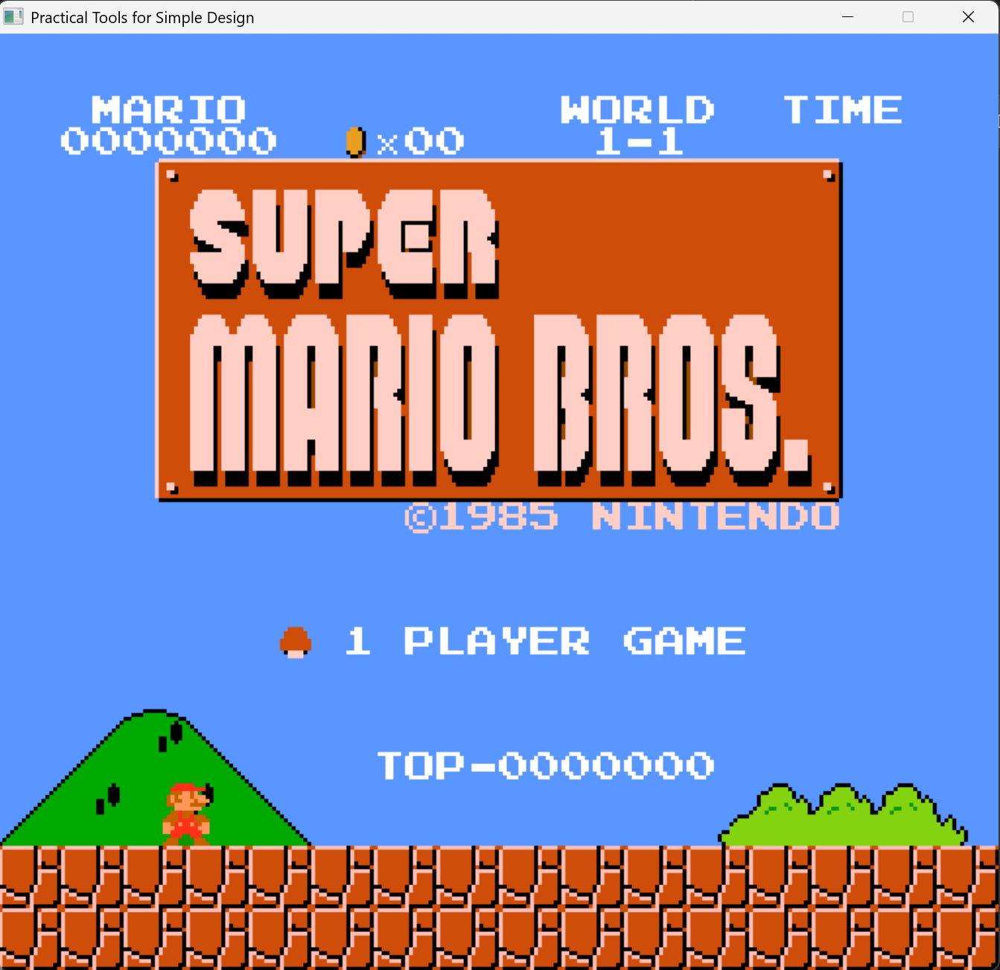
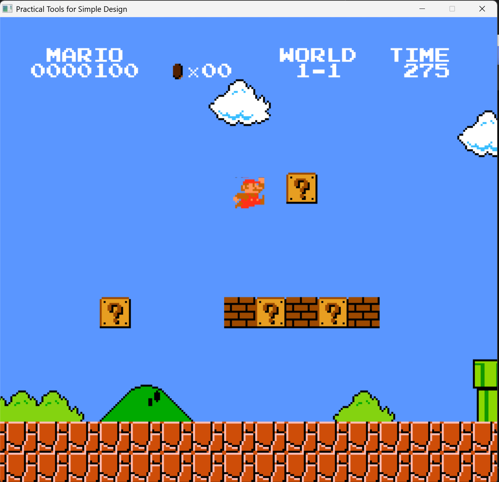
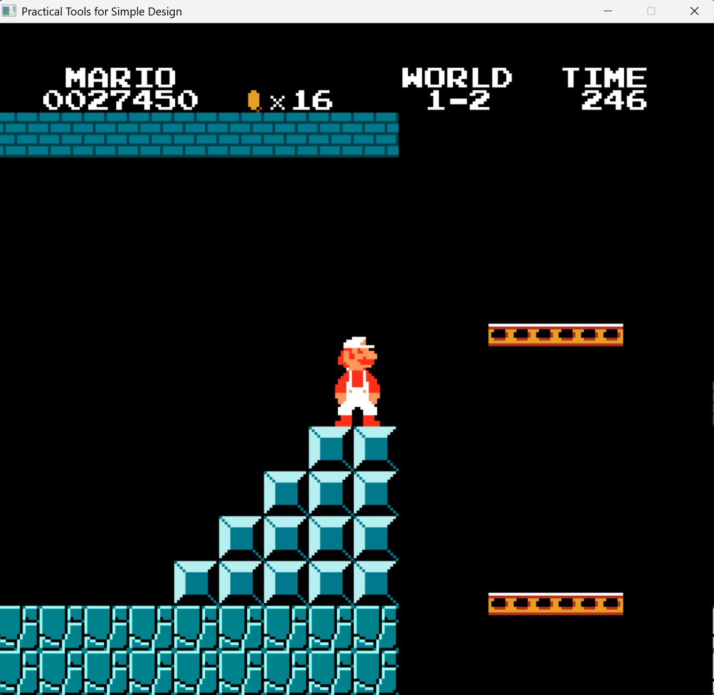
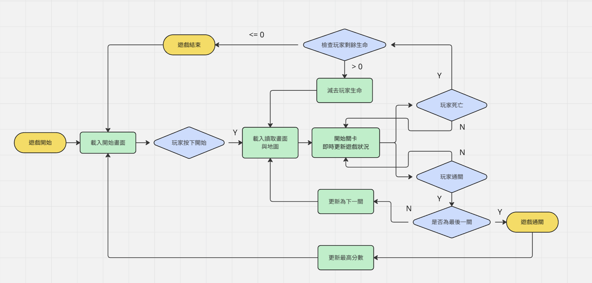

# 2025 OOPL Final Report

## 組別資訊

組別：第51組
 
組員：112590019 謝政軒  112590013 陳岱佑
 
復刻遊戲：超級瑪利歐

## 專案簡介

### 遊戲簡介
復刻NES版的超級瑪利歐 
一個義大利水管工去救被烏龜綁架的公主 
 
玩家將會操控瑪利歐闖關，瑪利歐可以進行移動與跳躍的操作 
關卡中會有道具、方塊、敵人等要素 
玩家的目標會是觸碰到關卡結尾的旗子，即可通關 
 
遊戲類型：2D、橫向卷軸 
遊戲內容：原版遊戲中的 1-1、1-2、1-4 (遊戲中顯示為1-3) 三個關卡
 
遊玩影片連結：[Gameplay](https://youtu.be/aCL4wka4cNI)

### 組別分工
| Week | 謝政軒 | 陳岱佑 |
|------|--------|--------|
|  01  | 蒐集遊戲素材 | 遊戲素材處理 |
|  02  | 設計角色基本類別 | 設計與測試碰撞箱 |
|  03  | 設計瑪利歐類別，包含初始化設定、角色移動、物理處理 | 設定瑪利歐的動畫處理與狀態變化時的圖片調換 |
|  04  | 修正與調整瑪利歐的物理處理和加入長短跳，設計方塊基本類別 | 測試瑪利歐的碰撞箱判斷與處理，讓遊戲畫面能夠隨著瑪利歐移動 |
|  05  | 設計問號箱、水管與磚塊類別，測試方塊能否在地圖中繪製出來 | 設計與測試瑪利歐和方塊(碰撞箱)碰撞時的判斷、位置與速度修正 |
|  06  | 設計地圖管理員類別，將地圖的背景、方塊繪製整合 | 將關卡的方塊設定(種類、位置)轉為二維陣列儲存於MapDataHolder
|  07  | 測試地圖管理員，設計碰撞管理員類別，集中處理物件的物理與碰撞 | 在MapDataHolder中加入關卡地板碰撞箱位置與寬高、水管位置與高度、旗子位置的紀錄
|  08  | 設定地圖管理員與碰撞管理員的互相配合，處理物件的建構與刪除、互相取得資訊 | 測試遊戲的地圖繪製與物件碰撞判斷，修正Bug | 
|  09  | 設計道具的基本類別，設計蘑菇、火焰花與金幣類別，將道具加入到地圖、碰撞管理員 | 將金幣與蘑菇加入到問號箱，撰寫問號箱生成道具的函式和瑪利歐射火球的函式，測試瑪利歐碰到道具的變化 |
|  10  | 設計栗寶寶與烏龜的類別，將怪物加入到管理員，撰寫與測試瑪利歐和怪物的碰撞判斷 | 將隱藏關卡的資訊加入MapDataHolder，加入瑪利歐能進入特殊水管的功能，包含進出動畫、轉換地圖 |
|  11  | 撰寫關卡通關的判斷、關卡通關動畫(旗幟落下、瑪利歐進入城堡)、進入下一關的功能，完成第一關所有物件的繪製與碰撞判斷 | 撰寫第二關的開始動畫，將第二關的所有物件資訊(方塊、地板、怪物)紀錄於MapDataHolder，修正地圖轉換的Bug
|  12  | 撰寫食人花與移動平台類別，測試第二關的物件是否完整、隱藏水管能否正確進入正確的關卡 | 完成第二關所有物件的繪製與碰撞判斷，將第三關的所有物件資訊(方塊、地板、怪物)紀錄於MapDataHolder，撰寫火球陷阱類別 |
|  13  | 設計庫巴的類別，撰寫庫巴的邏輯判斷(左右移動、射火球、跳躍)，測試庫巴與瑪利歐的互動是否正常 | 撰寫橋梁與斧頭的類別，完成第三關所有物件的繪製與碰撞判斷，測試火球陷阱是否正常運作 |
|  14  | 設計系統管理員，整合管理UI、遊戲畫面、瑪利歐的分數、金幣、剩餘時間與生命，加入與遊戲的開始、讀取、結束畫面 | 撰寫碰到斧頭時橋梁消失的功能、遊戲的通關動畫，測試通關動畫結束時能夠正確回到開始畫面、能夠再次遊玩遊戲
|  15  | 完成UI設定與分數系統，測試瑪利歐得到道具和打倒敵人時分數/金幣會增加、通關時會將剩餘時間轉為分數，測試瑪利歐死亡時能夠正常減去生命或是進入結束畫面並回到開始畫面 | 加入遊戲通關時出現的通關訊息，撰寫與測試在通關遊戲時最高分數能否正常更新，測試在關卡轉換時時間能夠正常重置、時間到的話瑪利歐是否會死亡 |
|  16  | 為瑪利歐、怪物、方塊等物件加入音效，測試音效是否有遺漏、能正常播放 | 加入BGM，測試BGM能否正常播放、關卡是否播放正確的BGM |
|  17  | 檢查與修正管理員類別中可能出現的Memory Leak、物件未正確處理的問題 | 確認遊戲是否能正常運作，檢查遊戲中是否有會嚴重影響遊玩的Bug，進而修正 |
|  18  | 期末檢查 | 期末檢查 |

## 遊戲介紹

### 遊戲規則
玩家在關卡中的目標為抵達關卡最後的城堡 
當玩家觸碰到城堡前的旗子時，關卡通關 
玩家需要打倒/躲避關卡中的陷阱如敵人、坑洞...等 
關卡中也會有能夠協助玩家通關的道具如蘑菇和火焰花

### 遊戲畫面

## 程式設計

### 程式架構

### 程式技術
使用到的OOP技術： 
封裝、繼承、多型、介面、組合 
Object Casting、Function Matching

## 結語

### 問題與解決方法

| 問題 | 解決方式 |
|------|----------|
|如何讓遊戲畫面跟著玩家移動|在PTSD中處理遊戲畫面的函式裡加入鏡頭位置，將每個物體在繪製時加上鏡頭的偏移量|
| 地圖的方塊過多，導致遊戲發生卡頓 |將地板直接當作一整個碰撞箱來繪製，而不是一格一格的繪製方塊 |
|當畫面上有怪物時，平台的移動速度突然變快|先處理平台的物理移動，再處理怪物的物理|

### 自評

| 項次 | 項目                   | 完成 |
|------|------------------------|-------|
| 1    | 這是範例 |  V  |
| 2    | 完成專案權限改為 public |  V  |
| 3    | 具有 debug mode 的功能  |  V  |
| 4    | 解決專案上所有 Memory Leak 的問題  |  V  |
| 5    | 報告中沒有任何錯字，以及沒有任何一項遺漏  |  V  |
| 6    | 報告至少保持基本的美感，人類可讀  |  V  |
| 7    | 遊戲能正常開啟、遊玩 |  V  |

### 心得
透過在這門課中運用OOP的技術實作遊戲，我們除了深刻複習上學期學到的知識以外，也學到如何將這些技術實際運用於遊戲的實作，增加了程式的易讀性、管理、撰寫效率...等，雖然在實作的過程中經常為一些匪夷所思、不可思議的Bug搞到頭痛，但結果來說還是學到了非常多。

### 貢獻比例
謝政軒：50%  
陳岱佑：50%